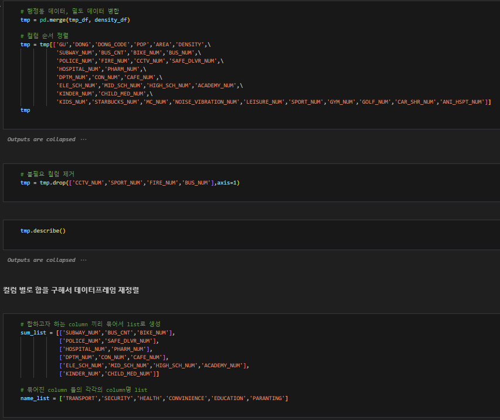
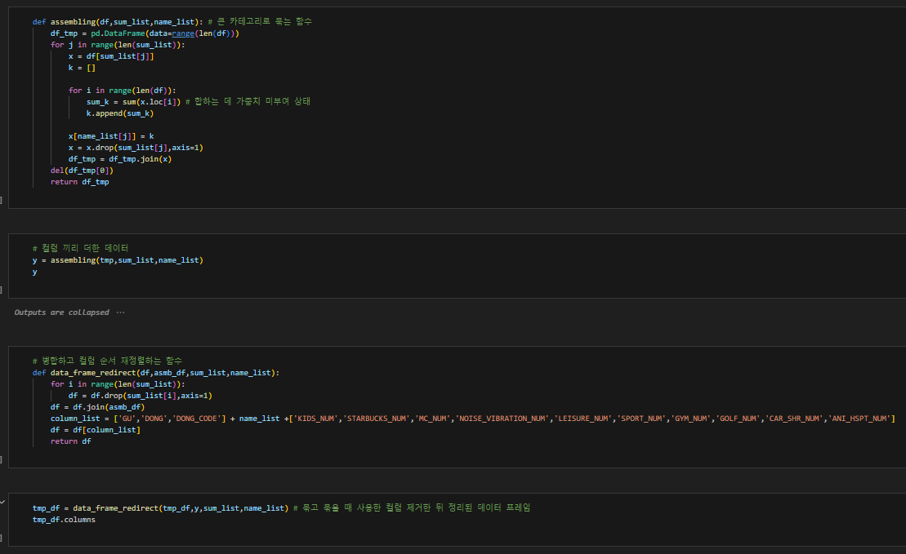
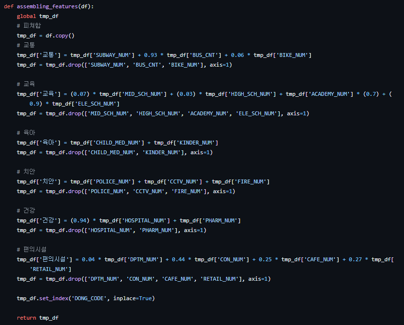
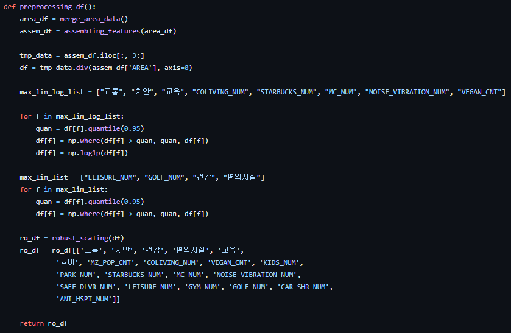

## 1. 내부 함수 작성
### 추천 시스템 구조
1. 거주 선택과 관련된 요소 6가지에 대해 1차 k-means cluster를 사용하여 분류
2. 주 타켓층(MZ 세대)들이 거주지 선택에 있어서 선호하는 요소들을 사용하여 2차 분류

### 작성 코드 예시
#### 함수 구성 전

#### 함수 구성 후

- 1차 분류를 위한 features를 다루는 함수
- '교통', '교육', '육아', '치안', '건강', '편의' 6가지 요소를 활용하였으며, 각 요소에 속하는 feature에 대해 가중치를 부여하고 통합

1. 교통 : 지하철, 버스, 자전거(따릉이) 정거장 수와 관련된 가중치를 계산하여 적용 및 통합하여 하나의 feature로 재구성
2. 교육 : 초등학교, 중학교, 고등학교, 학원의 수에 대한 가중치를 부여
	- 타겟층인 MZ 세대는 신혼 부부에 속하는 연령층도 포함되기에 학군에 대한 부분이 고려됨
3. 육아 : 소아과, 어린이집에 대한 부분을 포함
4. 치안 : 경찰, 소방서 및 CCTV 설치 수 등을 고려
5. 건강 : 병원, 약국의 수
6. 편의 시설 : 백화점, 편의점, 카페, 시장 수 대해 각각의 가중치를 부여

- 서울시 행정구 별 면적에 대한 데이터를 화룡
- 면적 대비 시설의 개수를 사용할 feature를 선정
- 개별 수치가 매우 큰 데이터에는 log scale을 적용
- 적용한 수치의 이상치 및 의미가 없는 값을 제거하기 위해 quantile을 적용
- 최종 사용할 데이터를 DF 형식으로 리턴

## 2. 가중치 로직 개발

- 1차 분류에 사용되는 feature들과  2차 분류에 사용되는 feature 간의 연관성을 고려하여 가중치를 부여