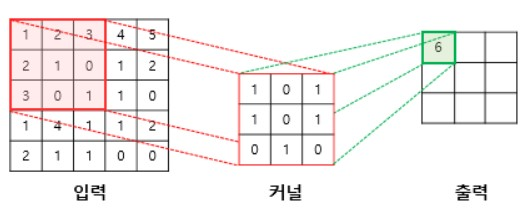
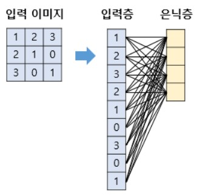
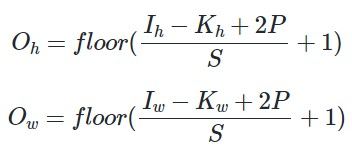
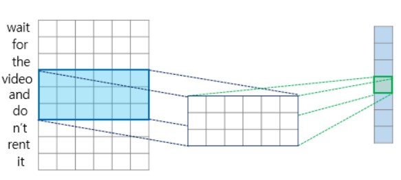

## CNN; Convolution Neural Network(합성곱 신경망)
### Concept
- CNN : 주로 이미지 처리; 비전 분야에서 사용되는 알고리즘. Convolution layer와 Pooling layer로 구성. 같은 대상에 대한 이미지임에도 다양한 변형이 존재해 이미지의 픽셀마다 가진 값이 상이해(1차원으로 변환하는 과정에서 spatial structure 정보가 유실되어 픽셀간의 연관 정보를 취하기 어려움) 다층 퍼셉트론을 통해 예측값을 얻는 데에는 민감도가 높음
- Channel : 이미지를 `[높이(세로 픽셀 수), 너비(가로 픽셀 수), 채널(색 성분)]` 이라는 3차원 텐서로 분석할 때, RGB 값을 통해 색 성분을 나타내는데 이를 채널이라고 함. 이미지가 흑백일 경우의 채널 값을 1, 유색일 경우의 채널 값은 R, G, B에 대해 나타나므로 3을 가짐
- Convolution operation : 커널로 `높이 x 너비` 크기의 이미지를 stride 기준으로 훑으면서 겹치는 부분의 이미지와 커널의 원소의 값을 곱해서 모두 더한 값을 출력 
    * Kernel;Filter : 라는 `nXm`크기의 행렬로 주로 3X3, 5X5을 사용
    * Stride : 커널이 한번에 이동하는 범위
    * Weight, Bias : 다층 퍼셉트론을 사용할 때에 비해 합성곱 인공 신경망으로 표현할 때의 가중치 수가 줄고, 공간적 구조 정보를 보존<br>  <br>
    * Feature map(특성 맵) : 합성곱 과정을 통해 얻은 값들로 구성된 matrix에 편향(값은 1가지)을 더한 결과물. 3차원 텐서(유색 이미지)에 대한 최종 특성 맵은 RGB에 대한 각각의 특성 맵의 합으로, 채널에 대한 정보를 포함하지 않음
        + `I_{h}` : 입력의 높이
        + `I_{w}` : 입력의 너비
        + `K_{h}` : 커널의 높이
        + `K_{w}` : 커널의 너비
        + `S` : 스트라이드
        + `O_{h}` : 특성 맵의 높이 
        + `O_{w}` : 특성 맵의 너비 
- Padding : 합성곱 연산의 결과로 얻은 특성 맵이 입력보다 크기가 작아지기 때문에, 입력 크기와 동일하게 유지하기 위해 입력의 가장자리에 지정된 개수의 폭 만큼의 행과 열을 추가하는 것으로 주로 zero padding을 사용 
- Convolution layer : 합성곱 연산과 그 결과에 비선형성을 추가하기 위한 활성화 함수 ReLU를 지나는 층으로 특성 맵을 통해 **추출한 이미지의 특징을 표현**
- Pooling layer : 특성 맵을 다운 샘플링하여 특성 맵의 크기를 줄이는 pooling 연산을 진행하는 층으로, 다운 샘플링 과정에서 커널과 스트라이드를 사용하나 합성곱 층과는 달리 학습할 가중치 값을 가지지 않음
    * Max pooling : 특성 맵과 커널과 겹치는 영역에서의 최댓값을 추출
    * Average pooling : 특성 맵과 커널과 겹치는 영역에서의 평균값을 추출

---

### 1D Convolution
- 자연어 처리에 사용
- LSTM에서 문장은 embedding layer를 거쳐 각 단어가 embedding vector로 변환되어 LSTM의 입력으로 사용
- Convolution에서도 문장을 토큰화, 패딩, 임베딩을 거쳐 `kXn`형태의 행렬로 변환(n : 단어 개수)하고, k를 커널의 너비로 하여 커널의 높이 만으로 커널의 크기를 정의. 따라서 커널은 아래방향으로만 이동하면서 feature map을 생성하여 1차원 형태의 결과값을 얻음. 
- Max pooling : 1D CNN의 Pooling layer에서 주로 사용하는 pooling. 각 합성곱 연산으로부터 얻은 결과 벡터에서 가장 큰 값을 가진 스칼라 값을 추출하는 연산
*의문점*
- 1D CNN을 사용한 신경망 구성에 있어서 여러 종류의 커널을 사용하는 이유는 무엇일까

### Keras CNN Example

```python
from tensorflow.keras.layers import Conv1D, GlobalMaxPooling1D

model = Sequential()
model.add(Conv1D(num_filters, kernel_size, padding='valid', activation='relu'))
# num_filters : 커널의 개수
# kernel_size : 커널의 크기
# padding : 패딩 방법 -> valid : 패딩 없음. // same : 합성곱 연산의 입출력의 크기를 동일하도록 제로 패딩
# activation : 활성화 함수
model.add(GlobalMaxPooling1D())
```

### Character Embedding(문자 임베딩)
- 단어의 어구를 사용하여 입력된 단어의 뜻을 예측
- 1D CNN을 사용하여 임베딩할 경우, 문자의 N-gram에서 정보를 추출
- BiLSTM을 사용할 경우, 문자 단위로 분리하여 이를 임베딩하고 이를 각각 순방향, 역방향 LSTM으로 읽어들여 순방향의 마지막 시점의 Hidden state와 역방향의 첫 번째 시점의 Hidden state을 concatenate하여 얻은 벡터를 사용