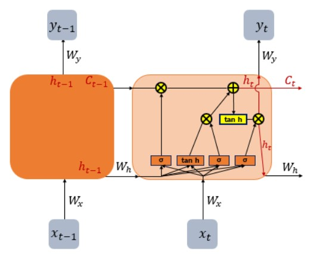

## Long Short-Term Memory; LSTM

### [RNN](./Recurrent_Neural_Network)의 구조

- Recurrent Network : *현 시점의 예측 값*을 출력하기 위해 *이전 시점의 정보*(예측 값)들을 참고하는 형태
### RNN의 한계
- *Long-term dependencies(장기 의존성)*
	- Vanila RNN(기본형 RNN)은 비교적 *짧은 시퀀스*에 대해서만 효과를 보임
	- Time lags(시점)이 길어질 수록 앞의 정보가 뒤로 충분히 전달되지 못하는 현상 발생

### LSTM의 구조

- Hidden layer(은닉층)의 메모리 셀에 입력 게이트, 망각 게이트, 출력 게이트를 추가하여 불필요한 기억은 지우고, 기억해야 할 것들을 선정
	- $x_{t}$ : $t$ 시점의 입력 값;  $y_{t}$ : $t$ 시점의 출력 값;  $h_{t}$ : $t$ 시점의 hidden state
    * **Cell state($C_{t}$)** : 이전 시점의 cell state가 다음 시점의 cell state를 구하기 위한 입력으로 사용, 삭제 게이트의 값이 0에 가까울 수록 이전 시점의 cell state의 영향력이 작아지고, 입력 게이트의 값이 현 시점의 cell state에 영향을 미침 $$C_{t} = f_{t}\circ C_{t-1} + i_{t}\circ g_{t}$$
    * 입력 게이트 : 현재 정보를 기억하기 위한 게이트$$i_{t} = \sigma(x_{t}\cdot W_{xi}+ h_{t-1}\cdot W_{hi}),\ \ g_{t} = tanh(x_{t}\cdot W_{xg}+h_{t-1}\cdot W_{hg})$$
    * Forget gate(망각 게이트) : 이전 시점의 입력을 얼마나 반영할 지를 0~1 사이 값으로 결정하는 게이트로 0에 가까울 수록 많이 제거된 상태 $$f_{t} = \sigma (x_{t}\cdot W_{xf} + h_{t-1}\cdot W_{hf})$$
    * 출력 게이트 : $x_{t}$ 값과 $h_{t-1}$이 sigmoid 함수를 통과한 값으로 $h_{t}$를 결정 $$o_{t} = \sigma(x_{t}\cdot W_{xo}+h_{t-1}\cdot W_{ho}),\ \ h_{t} = o_{t}\circ tanh(C_{t})$$
### Gated Recurrent Unit; GRU

- GRU : LSTM에서 3개의 게이트(출력, 입력, 삭제)를 사용했던 반면, GRU에서는 업데이트 게이트, 리셋 게이트 2개를 사용하여 LSTM의 구조를 간략화 

---
[Ref.1](https://wikidocs.net/22888)
[Ref.2](https://cartinoe5930.tistory.com/entry/%EC%95%8C%EA%B8%B0-%EC%89%BD%EA%B2%8C-LSTM-networks-%EC%9D%B4%ED%95%B4%ED%95%98%EA%B8%B0)