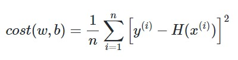
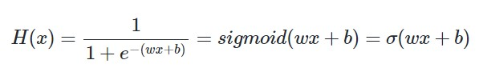
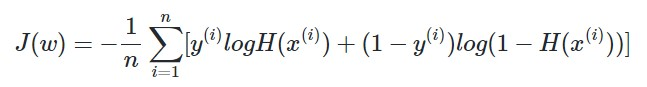
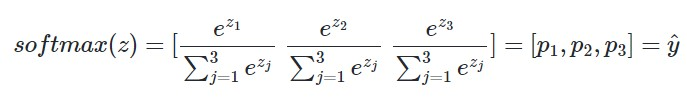
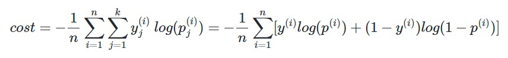
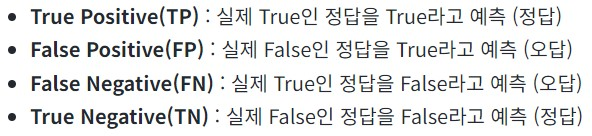
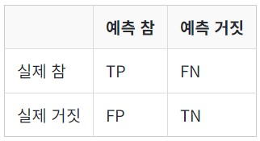

## What is Machine Learning?
- 기존의 방식은 코딩을 통해 사람이 특정 조건에 대한 해결 방식을 설정(알고리즘화)하는 방향으로 해결 -> 특징을 잡는 데 있어서 한계 발생
- 머신 러닝은 데이터와 정답을 동시에 제공함으로써 문제에 대한 규칙성을 컴퓨터가 직접 찾아내(training)고 이를 비슷한 문제에 대해 적용(testing)하는 방식
### ML Terms
- Data : Training, Validation, Testing으로 구분
    1. Training data : 모델의 학습용 데이터
    2. Validation data : 모델의 성능 조정용 데이터로 정확도를 측정하면서 Hyper-parameter를 튜닝하는데 사용
        + Overfitting(과적합) : 학습 데이터에 지나치게 맞추어 진 상태로, 테스트 데이터에 맞지 않은 모델링이 이루어진 상태
        + Underfitting(과소 적합) : 테스트 데이터의 성능이 올라갈 여지가 있음에도 훈련이 부족한 상태
        + Hyper-parameter : 모델의 성능에 영향을 주는, 사람이 값을 지정하는 변수
        + 매개변수 : 가중치와 편향. 학습을 하는 동안 값이 계속해서 변하는 수
    3. Testing data : 모델의 성능 평가(Validation)용 데이터
- Classification(분류) : 주어진 선택지(불연속적인 범위)에 대한 답을 결정
    * Binary CF(이진 분류)
    * Multi-class CF(다중 분류)
- Regression(회귀) : 연속적인 값의 범위 내에서 예측값이 나오는 경우
    * Linear Regression(선형 회귀) : 한 개 이상의 독립 변수와 종속 변수 간의 선형 관계를 Hypothesis(가설)을 통해 모델링 한 것
        + Simple LR
        + Multiple LR
        + Hypothesis : weight(가중치)와 bias(편향)을 통해 x와 y간의 관계를 식으로 나타내는 것
        + Cost Function : w와 b를 찾기 위해서 세운 실제값과 예측값의 오차를 계산하는 식
        + Mean Squared Error(평균 제곱 오차) : 오차의 제곱합에 대한 평균 
        + Optimizer(최적화 알고리즘) : 비용 함수를 최소화 하는 매개 변수 w, b를 찾을 때 사용하는 알고리즘 (ex - Gradient Descent)
    * Logistic Regression : BCF에 사용하는 알고리즘
        + Sigmoid Function : x, y간의 관계에서 y값이 0과 1사이의 값을 가지면서 S자 형태로 그려지는 함수 
        + Cross Entropy : 가중치 w를 최소로하는 비용함수를 만들 때, y값이 0일 때와 1일 때에 대한 값을 고려하여 생성한 Objective Function 
    * Softmax Regression : 3개 이상의 선택지에 대한 다중 클래스 분류 문제에 사용
        + Softmax Function : 선택지의 수 k에 대해 k차원의 벡터 z를 입력받아 각 클래스에 대한 확률을 추정   입력값으로 들어오는 독립변수 x의 차원수가 m 일 때, 이를 k 차원으로 축소시키는 작업이 필요(가중치 벡터 `m x k`)하고 이 때의 비용 함수는 Cross Entropy 함수 
- Supervised Learning(지도 학습) : Lable(정답)과 함께 학습
    * Self-Supervised Learning(자기지도 학습) : 레이블이 없는 데이터가 주어지면, 모델이 학습을 위해서 스스로 데이터로부터 레이블을 만들어서 학습
- Unsupervised Learning(비지도 학습) : 별도의 레이블 없이 학습
- Enforced Learning(강화 학습)
- Sample : 종속 변수 y를 예측하는데 사용하는 독립 변수 x의 모음(행)
- Feature : 종속 변수 y를 예측하는 데 사용하는 각각의 독립 젼수 x(열)
- Confusion Matrix(혼동 행렬) : 머신 러닝에서 사용하는 참/거짓 데이터에 대해 예측한 참/거짓값을 행렬로 나타낸 것
    * TP, FP, FN, TN 
    * Precision(정밀도) : TP/(TP+FP)
    * Recall(재현율) : TP/(TP+FN)
    * Accuracy(정확도) : (TP+TN)/(TP+FN+FP+TN) -> 더 중요한 데이터의 수가 적을 때 부적절

---
## Classification
### Binary Classification
### Multi-class Classification
---
## Regression
### Linear Regression
### Logistic Regression
### Softmax Regression