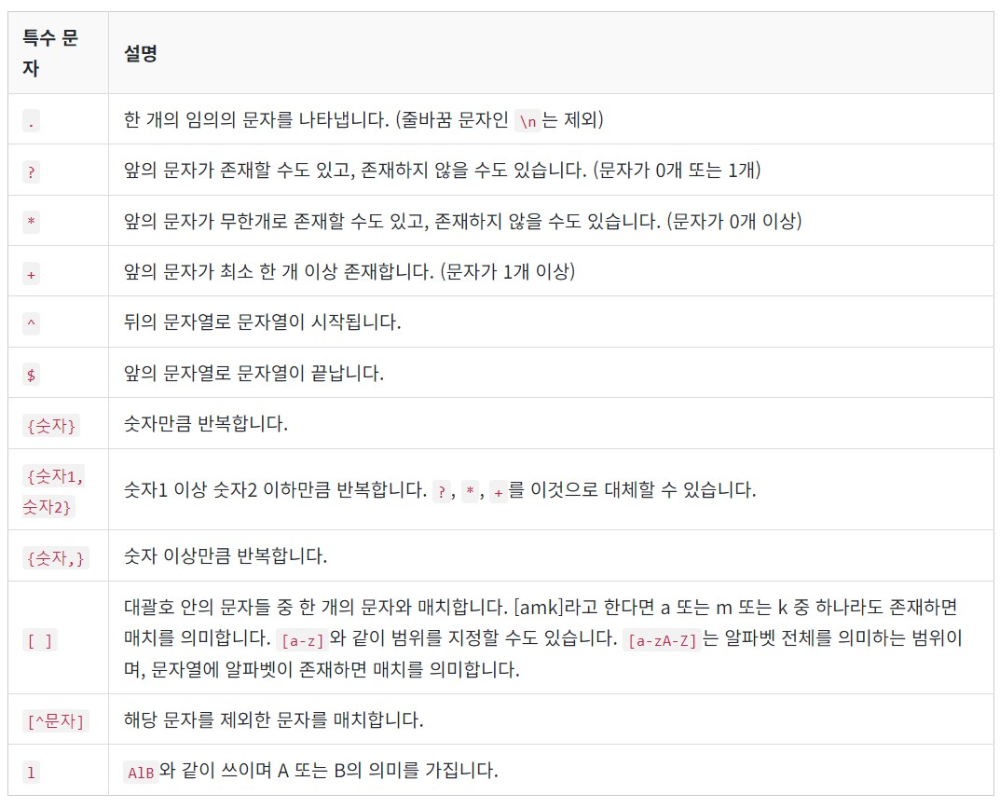
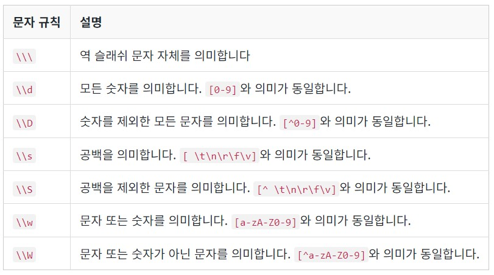
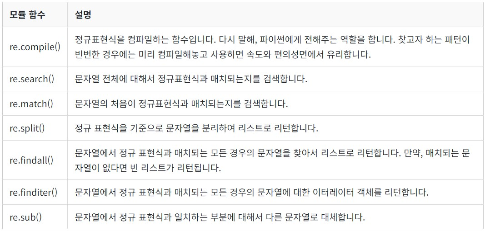

## Natural Language Processing; NLP
- Natural Language(자연어) : 일상 생활에서 사용하는 언어
- Natural Language Processing(자연어 처리) : 자연어의 의미를 분석하여 컴퓨터가 처리할 수 있도록 하는 일(ex - 음성 인식, 내용 요약, 번역, 감정 분석, 텍스트 분류, 질의 응답, 챗봇)
### 사용 Tools
- Anaconda : Python과 관련된 여러 패키지(Numpy, Pandas, JupyterNB, IPython, Scikit-learn, matplotlib, seaborn, etc)를 모아놓은 파일
- [Google-Colab](https://colab.research.google.com/) : Google에서 지원하는 Online IDE로, Tensorflow는 기본적으로 64-bit platform만을 지원하고, DL에서는 GPU를 이용하는 경우가 많기에, 개인 PC환경이 이를 지원하지 않을 경우 이용하는 것이 용이
### 필요 프레임워크
1. Tensorflow
2. Keras
3. Gensim : ML을 사용하여 토픽 모델링과 자연어 처리 등을 수행할 수 있게 해주는 오픈소스 라이브러리
4. Scikit-learn
5. Jupyter NB
6. NLTK : 자연어 처리를 위한 python 패키지로, 기능활용을 위해 `nltk.download()` 명령어를 통해 NLTK Data를 설치해주어야 함
- `treebank`라는 리소스가 설치되지 않아 오류가 발생할 경우 `nltk.download('treebank)`를 실행
7. KoNLPy : 한국어 자연어 처리를 위한 형태소 분석기 패키지
- Windows에서 KoNLPy 설치 및 실행에 있어서 JDK, JPype 오류가 발생할 수 있음
    * JDK 1.7 이상 설치 후 경로 확인 및 환경 변수 설정
    * JPype : JAVA, Python 연결해주는 역할을 하며 설치된 Python의 버전과 Windows OS의 bit에 맞게 설치(ex - JPype1-0.6.3-cp36-cp36m-win_amd64.whl)
---
## Text Preprocessing(텍스트 전처리)
- 문제의 용도에 맞게 텍스트를 사전에 처리하는 작업
### Text Preprocessing Progress
1. Tokenization(토큰화) : 전처리되지 않은 상태의 Copus 데이터는 용도에 맞게 토큰화, 정제, 정규화 작업을 통해 처리된다.
- Word Tokenization : 토큰의 기준을 단어(단어, 단어구, 의미를 갖는 문자열)로 설정
    * `NLTK`의 `word_tokenize()` <br> 띄어쓰기 단위로 구분
    * `NLTK`의 `WordPunctTokenizer()` <br> `.`, `,`, `!`등의 구두점을 제거, `'`는 보존
    * `Keras`의 `text_to_word_sequence()` <br> 모든 알파벳을 소문자로 바꾸면서 `.`, `,`, `!`등의 구두점을 제거, `'`는 보존
    * 단어 추출에서 단순히 띄어쓰기나 구두점의 제거는 원래 단어의 의미를 해칠 수 있음(줄임말, 자체로 띄어쓰기가 있는 경우 등)
    * `Penn Treebank Tokenization`
        1. 하이푼으로 구성된 단어는 하나로 유지한다.
        2. doesn't와 같이 아포스트로피로 '접어'가 함께하는 단어는 분리해준다.
- Sentence Tokenization : 토큰의 단위가 문장일 경우
    * `NLTK`의 `sent_tokenize()`
    * 한국어 문장 토큰화 도구 `KSS` <br> 한국어와 같은 교착어(조사, 어미등을 붙여서 말을 만드는 언어)의 경우 형태소(morpheme)를 활용
- Part-of-speech tagging(품사 태깅) : 단어 표기는 같으나 품사에 따라 의미가 달라지는 경우를 고려하여 tagging
    * `NLTK`의 `pos_tag()` <br> PRP는 인칭 대명사, VBP는 동사, RB는 부사, VBG는 현재부사, IN은 전치사, NNP는 고유 명사, NNS는 복수형 명사, CC는 접속사, DT는 관사
    * `KoNLPy`의 `Okt`, `Mecab, Komoran, Kkma, Hannanum`의 형태소 분석기
2. Cleaning(정제) : 갖고있는 corpus로부터 이상치(Noise Data)를 제거하여 토큰화 작업에 방해가 되는 부분을 배제
- Stopword(불용어) 제거 : 큰 의미가 없는 단어(자주 등장하나 분석에 있어서 도움이 되지 않는 단어)를 제거
    * `NLTK`의 `stopwords`
    * 한국어의 경우 직접 불용어 사전을 생성해야 할 때가 많음
- 등장 빈도가 적은 단어 제거 : 텍스트 데이터에 너무 적게 등장해서 자연어 처리에 도움이 되지 않는 단어들을 제거
- 길이가 짧은 단어 제거 : 영어권에서 짧은 단어의 경우 대부분 자연어 처리에서 크게 의미가 없는 단어로 불용어에 해당하여 이를 제거(ex - a, I, it, at, on, in, by, etc)
- 정규 표현식(Regular Expression) : 얻어낸 corpus에서 Noise Data의 특징을 잡을 수 있을 때 사용
    * 정규 표현식 문법 
    * Python 자체의 re모듈 
3. Normalization(정규화) : 표현 방법이 다른 단어들을 통합시켜서 같은 단어로 변환 - BoW(Bag of Words) 기반 자연어 처리에서 주로 사용
- Lemmatization(표제어 추출) : 형태학(Morphology) 기반 어간(Stem), 접사(Affix)로 구성되는 형태소에 따라 parsing을 진행하여 표제어를 추출
    * `NLTK`의 `WordNetLemmatizer` <br> 단어의 형태가 보존하지만, 본래 단어의 품사 정보를 알아야 정확한 결과를 얻을 수 있음
- Stemming(어간추출) : 정해진 규칙에 따라 단어의 어미를 제거하는 비교적 거친 분류 작업으로 결과값이 사전에 존재하지 않을 수 있음
    * `NLTK`의 `PorterStemmer` <br> Poter Algorithm을 기반으로 만들어진 어간 추출기
    * `NLTK`의 `LancasterStemmer`
- 대, 소문자 통합
4. Integer Encoding(정수 인코딩) : 자연어 처리에서 효율적인 처리를 위해 텍스트를 숫자로 바꾸어 사용
- Mapping : 각 단어를 등장 빈도수를 기준으로 정렬하여 고유 정수(index)에 매핑
    * `Python`의 `Counter`, `NLTK`의 `FreqDist`, `Keras`의 `Tokenizer.fit_on_texts()` <br> 문장에서 추출한 단어 리스트를 단어의 중복 제거 및 등장 빈도를 딕셔너리 형태로 출력
- Padding : 자연어 문장을 행렬로 변환해 일괄 처리하는데 이를 위해 문장의 길이를 동일하게 맞추는 작업
    * `Zero padding`
- One-Hot Encoding : 서로 다른 단어로 구성된 단어 집합에서 단어 집합의 크기를 벡터의 차원으로 하고, 표현하고 싶은 단어의 인덱스에 1의 값을 부여하고, 다른 인덱스에는 0을 부여하는 단어의 벡터화 기법. 단어의 개수가 늘어날 수록 벡터의 공간 비용이 증가하고 단어간의 유사도를 파악하기 어려움.
5. 한국어 전처리 패키지
- PyKoSpacing : 띄어쓰기가 되어있지 않은 문장을 띄어쓰기한 문장으로 변환
- Py-Hansapell : 네이버 한글 맞춤법 검사기를 바탕으로 만들어진 패키지로 띄어쓰기 및 맞춤법을 수정
- SOYNLP : 품사 태깅, 단어 토큰화 등을 지원하는 tokenizer로, 비지도 학습을 통해 데이터의 자주 등장하는 단어들을 단어로 분석
    * `Cohesion probability(응집 확률)` <br> Substring(내부 문자열)이 얼마나 응집하여 자주 등장하는지를 판단하는 척도 
    * `Branching entropy` <br> 확률 분포의 엔트로피 값을 사용하여, 주어진 문자열에서 얼마나 다음 문자가 등장할 수 있는지를 판단하는 척도로 활용
    * `L Tokenizer` <br> 한국어는 띄어쓰기 단위로 나눈 어절 토큰이 L토큰 + R토큰의 형식을 가질 때가 많은데, 점수가 가장 높은 L토큰을 찾아내는 원리로 분리
    * `MaxScoreTokenizer` <br> 띄어쓰기가 되지 않은 문장에서 점수가 높은 글자 시퀀스를 순차적으로 찾아 분리
    * `normalizer` <br> 채팅 데이터나 이모티콘 등에서 반복되는 문자를 정제하여 하나로 정규화
- CKoNLPy(Customized Konlpy) : add_dictionary()를 사용하여 단어와 품사를 추가해줌으로써 토큰 분류를 조정
---
## Language Model(언어 모델)
`Language Model` : 단어 시퀀스(문장)에 문장의 적절성에 대한 확률(단어에 대한 예측을 통해)을 할당(assign)하는 모델
- Statistical(통계적)
- Artifitial Neural Network(인공 신경망)

1. 단어 시퀀스의 확률 : 하나의 단어를 `w`, 단어 시퀀스를 `W`라고 한다면, `n`개의 단어가 등장하는 단어 시퀀스 `W`의 확률은 
<br><br>
2. 다음 단어 등장 확률 : `n-1`개의 단어가 나열된 상태에서 `n`번째 단어의 확률은 조건부 확률 이고, <br><br> 전체 단어 시퀀스 `W`의 확률은 모든 단어가 예측되고 나서야 알 수 있으므로 

### Statistical Language Model, SLM
- `Chain Rule` <br> 문장(단어 시퀀스)의 확률은 문맥이라는 관계로 인해 이전 단어의 영향을 받아 다음 단어가 등장. 조건부 확률을 통해 일반화하면 이전 단어에 대한 등장확률의 곱으로 나타남
- 반복 등장 횟수 기반 접근 : 기계가 학습한 copus data에서 특정 단어 다음에 등장한 단어의 횟수를 확률로 사용
- `Sparsity problem` <br> LM은 실생활에서 사용되는 언어의 확률 분포를 주어진 Corpus data를 이용한 학습을 통해 근사 모델링하는데, 충분한 데이터를 관측하지 못하여 정확한 모델링을 할 수 없는 희소 문제가 발생할 수 있어 여러 generalization(일반화) 기법을 사용해 이를 보충
- `N-gram LM` <br> 전체 단어에 대해 고려하는 일반 LM과는 달리 `n`개의 단어에 대한 확률을 사용. 문장이 길수록 corpus 내에서 동일한 문장이 존재하지 않을 확률이 증가하므로, 참고하는 단어의 수를 줄임으로써 이를 근사치로 활용.<br> 참고 단어의 수에 따라 의도와는 다른 결과를 예측하거나, n이 클수록 모델 사이즈가 커지는 문제가 발생
- `Perplexity, PPL` <br> LM의 성능 비교에서 time cost를 줄이기 위해 사용하는 평가 지표로,  Branching Factor(선택할 수 있는 가능한 경우의 수)를 의미 
---
## Count based word Representation
- 텍스트를 수치화하여 통계적으로 접근
- 텍스트 데이터 내에서 특정 단어의 중요도, 문서의 핵심어 추출, 검색 엔진에서 검색 결과의 순위 결정, 문서들 간의 유사도를 구하는 등의 용도로 사용

### Word Representation(단어의 표현 방법)
- Local Representation(=Discrete Representation)(국소 표현) : 해당 단어 그 자체만 보고, 특정값을 매핑하여 단어를 표현
- Distributed Representation(=Continuous Representation)(분산 표현) : 특정 단어를 표현하고자 주변을 참고하여 표현


### BoW(Bag of Words)
- Bag of Words : 단어들의 출현 빈도(frequency)만을 고려하여 수치화, 순서는 고려하지 않음
```python
from konlpy.tag import Okt

okt = Okt()

def build_bag_of_words(document):
    # 온점 제거 및 형태소 분석
    document = document.replace('.', '')
    tokenized_document = okt.morphs(document)

    word_to_index = {}
    bow = []

    for word in tokenized_document:  
    if word not in word_to_index.keys():
        word_to_index[word] = len(word_to_index)  
        # BoW에 전부 기본값 1을 넣는다.
        bow.insert(len(word_to_index) - 1, 1)
    else:
        # 재등장하는 단어의 인덱스
        index = word_to_index.get(word)
        # 재등장한 단어는 해당하는 인덱스의 위치에 1을 더한다.
        bow[index] = bow[index] + 1

    return word_to_index, bow
```
```python
# CountVenctorizer in Scikit-learn pakage
# 영어 기준이기 때문에 띄어쓰기에 따라 토큰화 -> 한국어에서 조사 등의 구분이 되지 않음
from sklearn.feature_extraction.text import CountVectorizer

corpus = ['you know I want your love. because I love you.']
vector = CountVectorizer()

# 코퍼스로부터 각 단어의 빈도수를 기록
print('bag of words vector :', vector.fit_transform(corpus).toarray()) 

# 각 단어의 인덱스가 어떻게 부여되었는지를 출력
print('vocabulary :',vector.vocabulary_)
```

### DTM;Document Term Matrix(문서 단어 행렬)
- 다수의 문서에 대해 각 문서의 BoW를 합쳐서 하나의 행렬로 표현
- 전체 corpus의 크기가 클수록 Sparse representation에 대한 손실(0인 값을 갖는 벡터가 많아짐)이 발생 : 구두점, 낮은 빈도수의 단어, 불용어의 제거 혹은 표제어, 어간 추출을 통해 정규화를 진행하여 보완
- 단순히 빈도수가 높은 단어가 중요도가 높다는 근거 부족(불용어)

### TF-IDF;Term Frequency-Inverse Document Frequency
- DTM 내의 각 단어들마다 중요도에 따른 가중치 부여
- 문서를 d, 단어를 t, 문서의 총 개수를 n이라고 표현할 때,
    * tf(d,t) : 특정 문서 d에서의 특정 단어 t의 등장 횟수(tf;token frequency)
    * df(t) : 특정 단어 t가 등장한 문서의 수(df;document frequency)
    * idf(t) : df(t)에 반비례하는 수(idf; inverse df)
- 모든 문서에서 자주 등장하는 단어는 중요도가 낮다고, 특정 문서에서만 자주 등장하는 단어는 중요도가 높다고 판단
- 문서의 유사도, 검색 시스템에서 검색 결과의 중요도 부여, 문서 내의 특정 단어의 중요도 측정 등에 사용
```python
import pandas as pd # 데이터프레임 사용을 위해
from math import log # IDF 계산을 위해

docs = [
    '먹고 싶은 사과',
    '먹고 싶은 바나나',
    '길고 노란 바나나 바나나',
    '저는 과일이 좋아요'
] 
vocab = list(set(w for doc in docs for w in doc.split()))
vocab.sort()

# 총 문서의 수
N = len(docs) 

def tf(t, d):
    return d.count(t)

def idf(t):
    df = 0
    for doc in docs:
        df += t in doc
    return log(N/(df+1))

def tfidf(t, d):
    return tf(t,d)* idf(t)

result = []
# 각 문서에 대해서 아래 연산을 반복
for i in range(N):
    result.append([])
    d = docs[i]
    for j in range(len(vocab)):
        t = vocab[j]
        result[-1].append(tf(t, d))

tf_ = pd.DataFrame(result, columns = vocab)

result = []
for j in range(len(vocab)):
    t = vocab[j]
    result.append(idf(t))

idf_ = pd.DataFrame(result, index=vocab, columns=["IDF"])
idf_

result = []
for i in range(N):
    result.append([])
    d = docs[i]
    for j in range(len(vocab)):
        t = vocab[j]
        result[-1].append(tfidf(t,d))

tfidf_ = pd.DataFrame(result, columns = vocab)
tfidf_
```
## Vector Similarity
- 문장이나 문서의 유사도를 구하는 작업
    * 어떤 방법으로 수치화하여 표현했는가
    * 문서 간의 단어들의 차이를 어떤 방법으로 계산했는가

### Cosine Similarity
- BoW 기반 표현방법(DTM, TF-IDF), Word2Vec 등을 통해 문장을 벡터화
- 두 벡터 간의 cosine 각도를 이용하여 두 벡터의 유사도를 측정

```python
import numpy as np
from numpy import dot
from numpy.linalg import norm

def cos_sim(A, B):
  return dot(A, B)/(norm(A)*norm(B))

doc1 = np.array([0,1,1,1])
doc2 = np.array([1,0,1,1])
doc3 = np.array([2,0,2,2])

print('문서 1과 문서2의 유사도 :',cos_sim(doc1, doc2))
print('문서 1과 문서3의 유사도 :',cos_sim(doc1, doc3))
print('문서 2와 문서3의 유사도 :',cos_sim(doc2, doc3))
```
### Euclidean Distance
- 공간에 위치한 두 점 p, q사이의 직선거리

```python
import numpy as np

def dist(x,y):   
    return np.sqrt(np.sum((x-y)**2))

doc1 = np.array((2,3,0,1))
doc2 = np.array((1,2,3,1))
doc3 = np.array((2,1,2,2))
docQ = np.array((1,1,0,1))

print('문서1과 문서Q의 거리 :',dist(doc1,docQ))
print('문서2과 문서Q의 거리 :',dist(doc2,docQ))
print('문서3과 문서Q의 거리 :',dist(doc3,docQ))
```

### Jaccard Similarity
- 교집합을 갖는 서로 다른 집합 A, B에서 합집합에 대한 교집합의 비율

